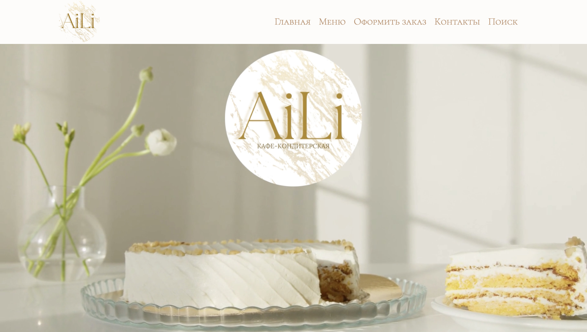
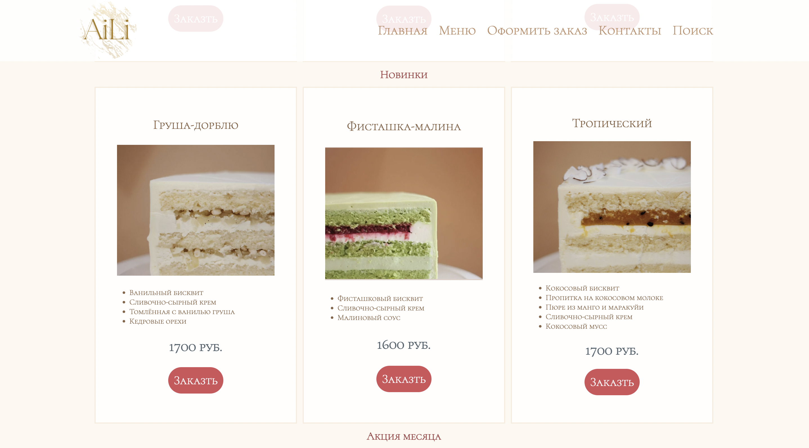
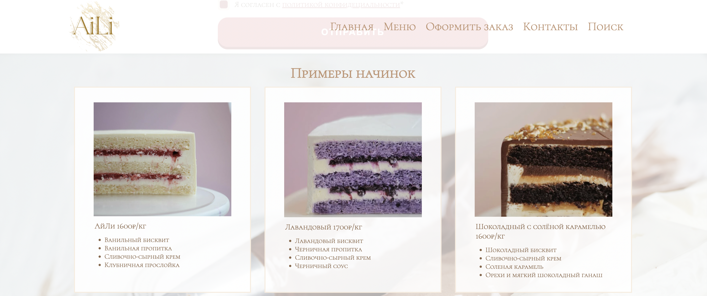

<p width=100%>

</p>


## Description / Описание

Four-page site for a cafe-confectionery. 
Четырехстраничный сайт для кафе-кондитерской.

## Features / Функции

1. The main page, which contains a description of the cafe-confectionery and current promotions. <br>Главная страница, которая содержит описание кафе-кондитерской и действующих акций.
<p align="center">
</p>
<p align="center">
</p>
2. The main menu, where the entire range of products is presented. <br>
Главное меню, где представлен весь ассортимент товаров.
<p align="center">
</p>
3. Page for placing an order. <br> Страница для оформления заказа.
<p align="center">
</p>
<p align="center">
</p>
<p align="center">
</p>
<p align="center">
</p>

4. Page with contact details and locations. <br> Страница с контактными данными и адресами.
<p align="center">
</p>

## Project setup / Установка

```
npm install
npm run serve
```
